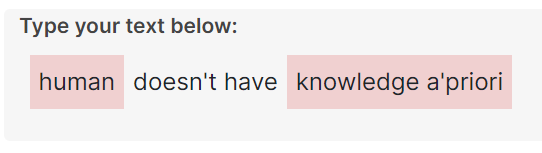

Renders Notion-like text field that contain both: 
* normal text, and
* inline widgets

## How it works
Text passed to component must be stored as a collection of objects (each containing `type` property).

The component iterates through the collection and renders the right component for each.

It inserts empty `TEXT` objects between other components to be able
to place the cursor between them.

## Re-usability
It **could** work with any collection that contain `type` and `value` properties.

To make it reusable, provide available `types` and corresponding components via `props`.
